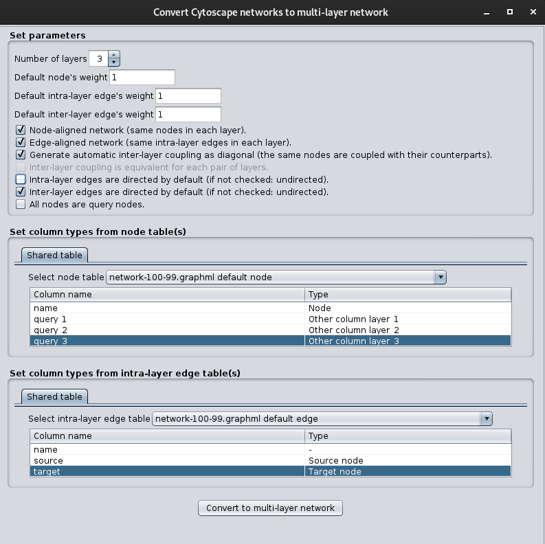

# Documentation for TimeNexus

**v1.0.0-SNAPSHOT**

*TimeNexus* needs Cytoscape 3.8+, as it depends on Java 11.

## Definitions

* **Network:** set of nodes linked by edges, both are so-called “**network elements**”.
* **Multi-layer network:** set of several networks, each of them being a **layer**, linked together through the **inter-layer edges**.
  * **Node-layer:** a node from a given layer. If a node-layer has counterparts (“*n_1*”, “*n_2*”…) in several layers, then “**node**” is referring to the common entity “*n*” and “**node-layer**” to one of its counterpart. 
  * **Intra-layer edges:** an edge linking a pair of node-layers from a same layer.
  * **Inter-layer edges:** an edge linking a pair of node-layers from two different layers.
* **Multi-edges:** when a node pair is linked by more than 1 edge.
* **Simple edge:** when a node pair is linked by only 1 edge.
* **Aggregation:** process reducing the complexity of an object. Example: multi-edges are aggregated into simple edges.
* **Node table:** a table where each row is a node and each column is an attribute of one node (ex: name, weight, edge direction…). Same principle for **edge tables**.
* **Query nodes:** they are a subset of the node-layers and they are needed by the extracting apps (PathLinker and AnatApp). Their algorithms use them to find paths between the query nodes and return one or more subnetworks, with different approaches. The extracting apps do not guarantee that the query nodes will be present in the extracted subnetwork.

## Convert networks or tables into a multi-layer network

The conversion is done by the tool: menu “Apps” > “TimeNexus” > “Convert”.

It shows a window where 1/ you set the properties of the multi-layer network and 2/ you set its elements and attributes.

### Set the properties of the multi-layer network

* **Number of layers:** set the number of layers within the multi-layer network. Higher it is, higher will be the network size and the run time.
* **Default weights:** if a weight is not defined, it will be set according to the default weight. The range of the weight should be constrained according to the type of extracting app which is going to be applied. I advise to keep it between 0 and 1, as a probability.
* **Node-aligned network:** the same node table will be used to set each node-layer table (= a node table specific to a layer). It involves that the nodes are shared by each layer (= layers are “node-aligned”). Yet, it is still possible to set specific weights or other attributes for a given layer. If the box is not checked, the user has to set a node table to each layer. Uncheck the box if you have several tables.
* **Edge-aligned network:** same as the “node-aligned network” parameter, but for intra-layer edges.
* **Generate automatic inter-layer edges:** inter-layer edges will be generated such as if two successive layers are sharing a node (= same node name), then an inter-layer edge will link the two counterparts of this node. The weight and the edge direction will be set according to the default parameters. If the inter-layer edges are not automatically generated, then the user has to set them using tables.
* **Inter-layer edge coupling is equivalent for each pair of layers:** same as the “node-aligned network” parameter, but for inter-layer edges.
* **Edges are directed:** if checked, then an edge, whose the direction is undefined (neither directed or undirected), will be set as directed by default. If unchecked, the edge will be undirected.
* **All nodes are query nodes:** this option involves that a boolean column “query” will be added to the node table of each layer, and its default value is “true”. It will be used for the subnetwork extraction.

### Set the column types for each tables of the multi-layer network

Cytoscape provides tables which are either created when a network is generated, giving node and edge tables, or when a table is directly imported from a file (e.g. “unassigned tables”).  Node and edge tables from networks have names ending by “default node” and “default edge”, respectively.

Network elements (nodes, intra-layer edges and inter-layer edges) of the multi-layer network have to be defined using tables. For each network elements, the following parameters are available:

* **Select table:** this table contains the network elements and, if available, their attributes.
* When a table is selected, it shows its columns:
  * **Column name:** the names of the columns. Every tables have a column called “name” which corresponds to the name of the element within Cytoscape.
  * **Column type:** the types of content that the column is containing. The type “**-**” is used to ignore a column.

Note that node names must be unique strings, edge direction must be boolean (“true” if the edge is directed) and weights must be float numbers (ex: 0.123).

#### Column types for nodes

* When tables have to be defined for each layer:
  * **Node:** mandatory column (with unique strings) containing the node names.
  * **Weight:** optional column (with float numbers) containing the weights.
  * **Other column:** optional column containing any kind of attributes for the nodes.
* For node-aligned networks, this is the same as above, but it is also possible
  * to have all layers sharing the same column, such as “**Node**”, “**Node weight”** and “**Shared column**”;
  * and to have columns setting node attributes in a given layer *i*, such as “**Node-weight layer *i***” and “**Other column layer *i***”. For “node-weight layer *i*”, please note that all rows should have a defined value within the node table, otherwise a null value will be replaced by the default weight.

#### Column types for edges

This is the same principle for intra-layer and inter-layer edges as for nodes. However:

* “**Source**” and “**Target**” replace “Node”, as they define the source node and the target node of the edge, respectively. If the edge is undirected, the source and target are exchangeable.
* **“Interact-with” column**: if the “source” and “target” columns do not exist, then the edge name can be parsed to extract the names of the source and the target. In this case, the edge name must have the format “**\<source> (interacts with) \<target>**”. This is the default format when a network is built from an edge list with the Cytoscape “import network” tool.
  * Tip: if an edge name has another format (ex: “\<source> -> \<target>”), you can change it using a Cytoscape built-in tool. Click on any cell of the column “name” within the edge table and then click on the [function builder](http://manual.cytoscape.org/en/stable/Column_Data_Functions_and_Equations.html) (“f(x)” on the top of the bottom panel). It opens a window. Select the function “substitute”. Under “next argument”, add 1/ “name” on the first field, then just below, 2/ add the text to replace (“->”) and after, add 3/ “(interacts with)”. Select “on the entire column” for “apply to” at the bottom of the window and click on “OK”.
* **Direction:** this type sets the direction of each edge, such as “true” means a directed edge.

Note that if there are N layers, then are N-1 inter-layer edges to set.

### Run the conversion

After executing a conversion, the window is not closed to enable the user to run again the conversion with other parameters.

### Access to the data of the multi-layer network

When a multi-layer network is generated, a collection of networks shows up within the list of networks.

* **Flattened network:** this is the main representation of the multi-layer network. It contains each node-layer, intra-layer edge and inter-layer edge.
  * Node-layers: their name has the format “\<node name>_\<layer ID>”.
  * For big multi-layers networks, the user should not generate a view using the standard Cytoscape layouts.
* **Aggregated network:** all layers are aggregated into one such as the node-layers representing the same node are merged. Also, if two node-layers “*n_i*” and “*m_i*” (*“i”* being the layer ID) are linked by an intra-layer edge “*n_i -> m_i*”, then their respective nodes “*n*” and “*m*” are linked by an edge “*n -> m*” within the aggregated network. The inter-layer edges are removed.
  * The node and edge attributes are lost during the aggregation.
* **Layers:** each network “*i_layer*” is a representation of the layer “*i*” (*“i”* being the layer ID). The tables of inter-layer edges, related to this layer, can be accessed through the bottom panel at the table “edge table”
  * Technically, the networks “*i_layer*” are subsets of the flattened network, so when the user changes the flattened network, it will change the layers (but not the aggregated network).
  * They are useful to export some parts of the multi-layer networks.

Several mandatory columns are added, e.g. they should not be removed, as the extraction and the visualization depend on them:

* **Layer ID:** this column contains the layer ID, as the layers are ordered, so each node and intra-layer edge is tagged with this ID. Inter-layer edges are tagged by the ID of the source layer.
* **Weight:** the weight of the element, a float number.
* **Direction:** the edge direction, “true” if the edge is directed, “false” or “null” otherwise.
* **Edge label:** it must be either “intra-layer” for intra-layer edges, and “inter-layer” for inter-layer edges. This is only useful for the flattened network, whose the edge table combines both types of edges.
* **Multi-layer network:** this column within the “network table” indicates whether the network is part of a multi-layer network connection.
* **Flattened network:** this column within the “network table” indicates whether the network is a flattened network.
* **Aggregated network:** this column within the “network table” indicates whether the network is an aggregated network.

### Avoid to change a built multi-layer network

I strongly advised against removing these columns and, in general, changing any of their values. The columns have a given name and type which are used by the algorithms of *TimeNexus*. Moreover, their values are not guaranteed to be consistent across the Cytoscape networks and tables.

In particular, the edge direction showed by the edge table does not indicate the internal direction within Cytoscape. This is critical for PathLinker as it uses the internal direction, instead of the value showed by the table. Both directions are the same when the multi-layer network is built by the *TimeNexus* conversion tool, but there are not kept consistent afterwards. However, Anat only uses the direction showed by the edge table.

In general, it is safer to build another multi-layer network from an updated version of the initial tables used to generate it.

## Extract subnetworks from multi-layer networks

The panel “*TimeNexus extractor*” on the left side enables to run a subnetwork extraction.

To use **PathLinker**, the app must be set up on Cytoscape. To use the algorithms of **AnatApp**, an Internet connect must be available, as *TimeNexus* will connect to the **Anat server;** so, it is not necessary to set up AnatApp on Cytoscape.

### Set the parameters

* **Select the multi-layer network**
  * **Load multi-layer network:** this button updates the list of multi-layer network collections which can be selected.
  * **Select multi-layer network:** select one multi-layer network collection. When a collection is selected, it updates the name of its flattened network.
  * **Select layers to use:** the extraction will be performed on this subset of layers. The subset must contain 2 or more layers, without gaps.
  * by default, TimeNexus checks if the multi-layer network has a valid format for the extracting app (see the section “Update the edge directions and aggreagte the multi-edges”). Yet, it takes 2/3 of the total runtime for big networks. Thus, this option can be disabled to speed up the process. It is advised to turn it on a first time to insure that the network is valid. Note that the validity of the format depends on the extracting app.
* **Select the extracting method**
  * **Global:** extraction is performed on the whole flattened network. The query source nodes are the query nodes of the first layer and the query source nodes are the query nodes of the last layer.
  * **Pairwise:** extraction is performed on successive subsets of 2 layers of the flattened network. For each of these 2-layer networks, the query source nodes are the query nodes of the first layer and the query target nodes are the query nodes of the second layer.
  * **One-by-one:** extraction is independently performed on each network. For each layer, the query source nodes and the query target nodes are the same.
* **Select the extracting app**
  * **PathLinker:** extraction is performed by sending the network(s) to the PathLinker app through its CyRest interface. PathLinker needs to be set up, but an Internet connection is not required to run the extraction.
  * **AnatApp:** extraction is performed by sending the network(s) to the Anat server. AnatApp does not need to be set up, but an Internet connection is required.
* **Select parameters of the app**
  * Here, the parameters depend on the app.
  * **Edge weight column:** this parameter cannot be changed, as the weight column is already set by the multi-layer network.
  * **Select columns with query nodes:** query nodes for each layers are set by selecting boolean columns from the node table.
    * For the algorithm “**shortest path**” of AnatApp, the query column contains node names. It sets paths to find from the nodes to their node query defined by the query column.

Note: Anat does not ignore edges with a weight equal to 0.0 (e.g. they can still be used), but the undefined edge weights will be set at 0.2. Yet, the behavior is unpredictable for undefined and null node weights (the values are somewhat replaced by one higher than 0.5 but it is unclear). **Thus, I recommend to avoid undefined node weights and undefined edge weights, as well as null node weights.**

### Update the edge directions and aggregate the multi-edges

* The directions of edges are updated to fit criteria of the extracting apps.
  * For **PathLinker**, if the option “network is directed” is selected, then the edges must be directed. Thus, before the extraction, the undirected edges will be converted into two edges with opposite directions. Alternatively, if the option is unselected, then the directed edges will become undirected.
  * For **AnatApp**, the algorithms enable networks with mixed directions, thus the edge directions are not updated.
    * Note: if the inter-layer edges are not directed, the The query source nodes are the query nodes of the first layer and the query source nodes are the query nodes of the last layer. server won’t be able to process the multi-layer network when using the global extraction method.
* Yet, **AnatApp** does not support multi-edges, while PathLinker supports only two edges with opposite directions for a given node pair.
  * For **PathLinker**, the multi-edges will be aggregated to have only simple edges for the case of undirected networks, or at most 2 edges with opposite directions for directed networks.
  * For **AnatApp**, all the multi-edges will be aggregated to have only simple edges.
  * In these two cases, if two edges with opposite directions are aggregated into one edge, then this edge will be undirected. At the contrary, if  edges having the same (un)direction are aggregated, then the final edge will keep this common (un)direction.
  * Moreover, when edges are aggregated together, the final edge will have a weight equal to the mean of the edge weights. The other attributes are ignored.
* After the extraction, the resulting subnetworks will not have these modifications. In other word, it will be a faithful subset of the initial multi-layer network.

### Output: resulting subnetworks

In its usual usage, **PathLinker** processes the given network and returns a list of *k* paths. Each path is made of nodes and edges, as well as its rank and score. All the paths are combined to shape the final subnetwork and its edges get the rank of their best path.

As we considered that the interactions are potential interactions, there is no biological reason to exclude an interaction between two proteins which are present, if there is no evidence to the contrary. Moreover, keeping these edges avoids to get multiple unconnected components while they are only separated by one edge.

Therefore, *TimeNexus* proceeds differently from PathLinker: it uses the nodes from the output paths of PathLinker to extract each edge linking these nodes. It means that some edges within the subnetwork were not involved in the paths, so a subnetwork from TimeNexus will have more edges than one directly from PathLinker. However, to get a “PathLinker-like” subnetwork, these edges can be hidden (*menu > Select > Hide selected nodes and edges*) by selecting the edges without a PathLinker score (*edge table > filter by PathLinker_score > select the empty rows > right click > “select edges from selected rows”*). Note that each edge has multiple ranks and scores within the columns “PathLinker_rank” and “PathLinker_score” because do not aggregate these values as PathLinker.

The same principle applies to **AnatApp**, except that there are only one score per edge, instead of multiple scores. Also, **Anat** gives scores to the nodes.

**In summary, *TimeNexus* extracts subnetworks while the apps combine paths.**

Note that the TimeNexus adds to the node tables of subnetworks a column “isQuery”. Its cell is equal to “true” if the node-layer was used as a query node by the extracting app, and “false” otherwise. This is useful to apply a style on the subnetwork views.

## Visualize multi-layer networks

The control panel “*TimeNexus Viewer*” on the left side enables to visualize the structure of multi-layer networks. It will update the view of a flattened network according to the layout of an aggregated network.

* **Select the networks**
  * **Select multi-layer network for the flattened network:** select one multi-layer network collection. When a collection is selected, it updates the name of its flattened network.
  * **Select multi-layer network for the aggregated network:** select one multi-layer network collection. When a collection is selected, it updates the name of its aggregated network.
    * If the aggregated network does not have a view, one will be generated according to the default Cytoscape layout.
* **Select the layers**
  * **Select the layer to focus:** the slider makes the focus on a given layer of the flattened network.
  * **Number of adjacent layers per side:** the view of the flattened network will show X layers adjacent to the layer selected above.
  * **Show adjacent layers:** the adjacent layers will be showed either forward, backward or on both sides of the layer selected above.
  * **Update the view:** show the view.

Tip: if there are isolated nodes within the aggregated network view, it is advised to select them, apply the grid layout on them and then, move them at the bottom of the view.

## Copy the layers of a flattened network

The tool “Copy flattened network” from the menu Apps > TimeNexus enables to make a full or partial copy of a multi-layer network, by selecting a subset of layers.

* **Select a multi-layer network:** select one multi-layer network collection.
* **Select layers to copy:** select one or more layers to copy. The layers which are not selected will not be part of the new multi-layer network.
* **Copy:** run the copy.

## Build a multi-layer network from a flattened network

To save a multilayer network, its flattened network can be exported into a network file. Later, the user can import back this file, but the multilayer network has to be rebuilt to use TimeNexus.

To do so, the user can run the tool “Build MLN from a flattened network” from the menu Apps > TimeNexus to select an independent flattened network from which the multilayer network will be built.

A multilayer network cannot be rebuilt from a flattened network which is already part of a another multilayer network.

This tool could be used to directly generate a multilayer network without going through the conversion tool, but the user has to provide a flattened network with the exact format to avoid errors.

## Add a style to the multilayer network

We provide the file “*TimeNexus_style.xml*” to update the style of multilayer networks. It can be applied to a view by following the procedure:

1. Import the style: Menu > File > Import > Styles from file.
2. Apply the style: Left-side bar “style” > select the style “#TimeNexus_style” at the top of the side panel.